# UNO R4 Arduino IDE 的下载、安装和使用方法

## 1. 下载&安装IDE

1\. 首先，我们需要下载Arduino IDE，进入网页链接：[https://www.arduino.cc/en/software](https://www.arduino.cc/en/software) 下载，根据不同的系统下载对应的Arduino IDE最新版本。

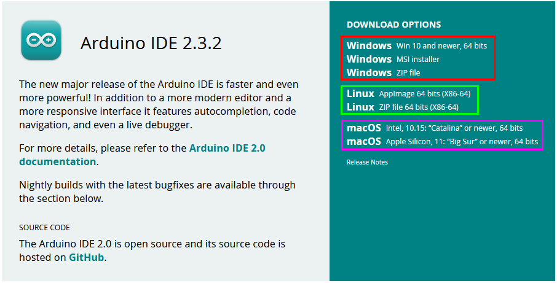

2\. 在电脑上安装Arduino IDE。

3\. 打开 Arduino IDE

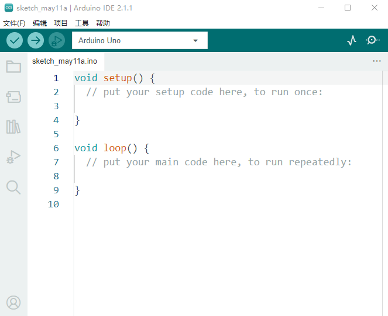

 -- 用于检查是否存在任何编译错误。
 -- 用于将程序上传到Arduino板。
 -- 用于编写程序时的单步调试。
 -- 用于从板接收串行数据并将串行数据发送到板的串行监视器。
-- 用于串口接收的数据转换成动态曲线图。
-- 用于打开最近保存的示例草图。
-- 用手动安装开发板。

## 2. 安装主板包

1\. 要安装主板包，从左侧菜单中打开“开发板管理器”。搜索“UNO R4” 并安装最新版本(或你想使用的版本)。

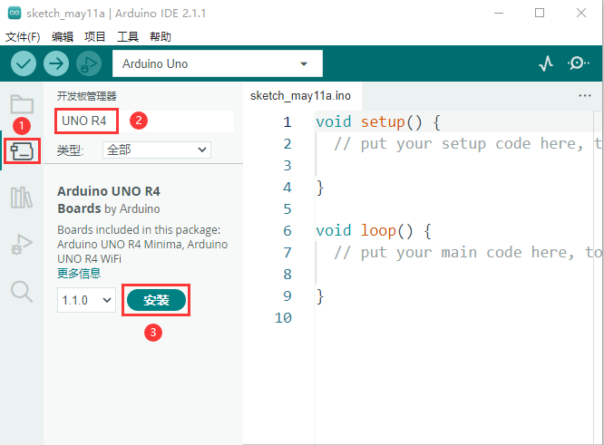

2\. 单击“工具” → “开发板”，你现在能够看到Arduino UNO R4 boards 后面分有开发板类型：“Arduino UNO R4 WiFi”和“Arduino UNO R4 Minima”。

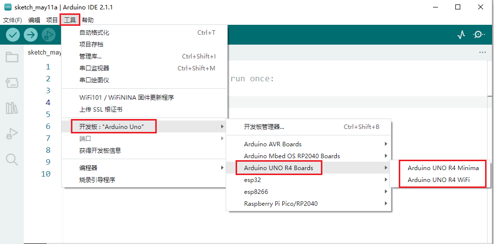

如果你将你的UNO R4 WiFi主板通过USB数据线连接到计算机，你可以看到如下所示：

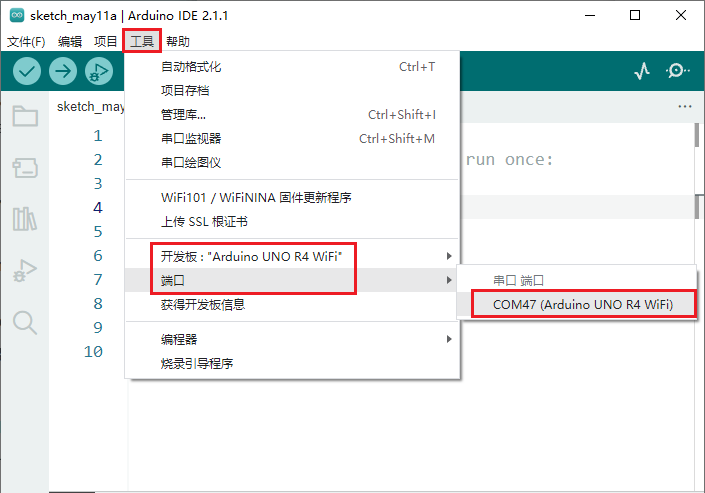

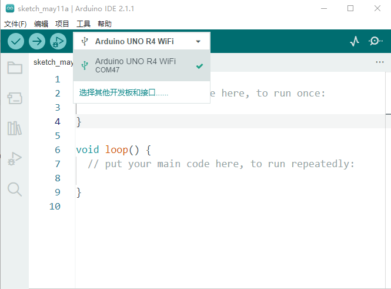

如果你将你的UNO R4 Minima主板通过USB数据线连接到计算机，你可以看到如下所示：

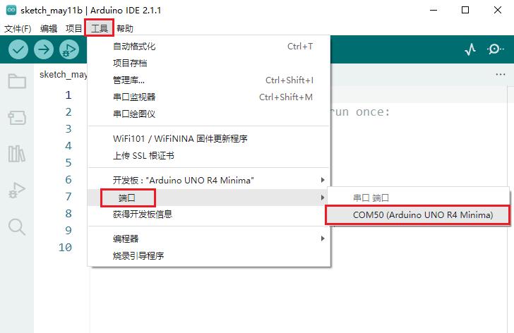

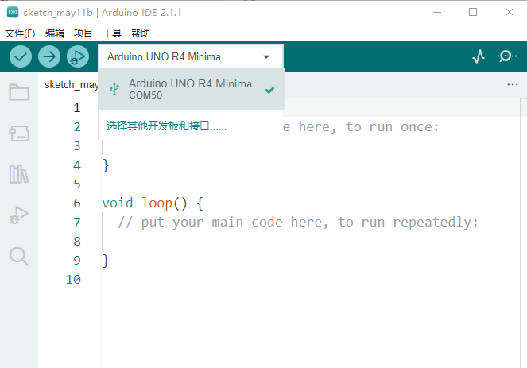

## 3. 编译&上传草图

可以直接在IDE中通过“文件”→“示例”→“01 Basics”→“Blink”访问，这个例子不需要外部库就可以直接使用。

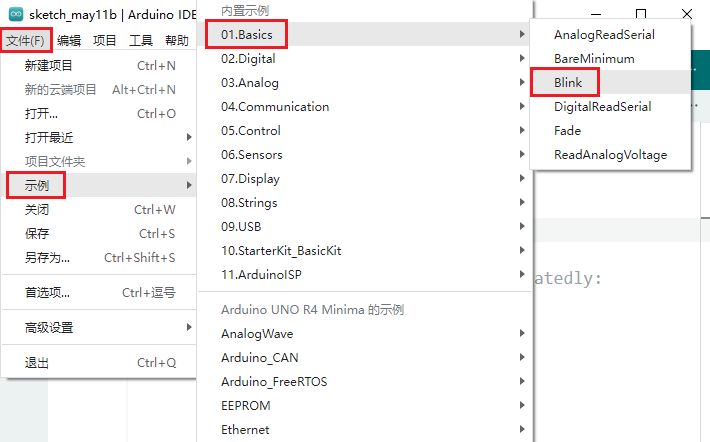

将你的UNO R4 WiFi主板通过USB数据线连接到计算机，选择好“Arduino UNO R4 WiFi”和端口。然后点击将程序代码上传至UNO R4 WiFi主板上，上传成功后，UNO R4 WiFi主板上的L灯闪烁。

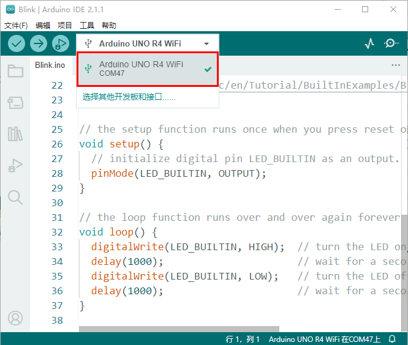

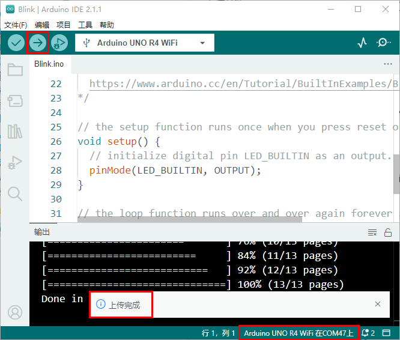

编译&上传草图至UNO R4 Minima主板上的方法类似，就不重复讲解。

